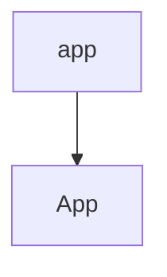

To add a function to the CLI app interface add a call to `goat.App`[<sup id="19uKFy">↓</sup>](#f-19uKFy) with with a `goat.Command`[<sup id="Z2rMq5x">↓</sup>](#f-Z2rMq5x) and your function ( `app`[<sup id="1R5sHl">↓</sup>](#f-1R5sHl).  
Don't forget to call `Run()`[<sup id="Z2toUaz">↓</sup>](#f-Z2toUaz) `Run()`[<sup id="Z2toUaz">↓</sup>](#f-Z2toUaz)
<!-- NOTE-swimm-snippet: the lines below link your snippet to Swimm -->
### 📄 sample/main.go
```go
⬜ 56     	return errors.New(msg)
⬜ 57     }
⬜ 58     
🟩 59     func main() {
🟩 60     
🟩 61     	goat.App("my-app",
🟩 62     		goat.Command(hello),
🟩 63     		goat.Command(greet),
🟩 64     		goat.Command(fail),
🟩 65     		goat.Command(app),
🟩 66     	).Run()
🟩 67     }
```

<br/>

# Example Function

<br/>

`Goat` has defaults for understanding your function's arguments. But you can add more options using `Flag`[<sup id="bgf28">↓</sup>](#f-bgf28). You can define the `Usage`[<sup id="1pY59a">↓</sup>](#f-1pY59a), `Name`[<sup id="xDXe">↓</sup>](#f-xDXe)and `Default`[<sup id="CYN1l">↓</sup>](#f-CYN1l) values.
<!-- NOTE-swimm-snippet: the lines below link your snippet to Swimm -->
### 📄 sample/main.go
```go
⬜ 10     
⬜ 11     
⬜ 12     
🟩 13     func app(name string, goodbye bool, question *string, times int) error {
🟩 14     	goat.Self().
🟩 15     		Name("application").
🟩 16     		Usage("app usage")
🟩 17     	goat.Flag(name).
🟩 18     		Usage("The name to greet")
🟩 19     	goat.Flag(goodbye).
🟩 20     		Name("bye").
🟩 21     		Usage("Enable to say Goodbye")
🟩 22     	goat.Flag(question).
🟩 23     		Usage("Instead of a greeting, ask a question.")
🟩 24     	goat.Flag(times).
🟩 25     		Usage("Number of repetitions").
🟩 26     		Default(1)
🟩 27     
🟩 28     	for i := 0; i < times; i++ {
🟩 29     		if question != nil {
🟩 30     			fmt.Printf("%s, %s?", *question, name)
🟩 31     		} else {
🟩 32     			if goodbye {
🟩 33     				fmt.Printf("Goodbye, %s.\n", name)
🟩 34     			} else {
🟩 35     				fmt.Printf("Hello, %s!\n", name)
🟩 36     			}
🟩 37     		}
🟩 38     	}
🟩 39     	return nil
🟩 40     }
⬜ 41     
⬜ 42     func hello() error {
⬜ 43     	goat.Self().
```

<br/>

<!--MERMAID {width:100}-->

<!--MCONTENT {content: graph TD
A\[ `app`[<sup id="1R5sHl">↓</sup>](#f-1R5sHl)\] \-\-\> B\[ `App`[<sup id="1PFvc4">↓</sup>](#f-1PFvc4)\]} --->

<br/>

<!-- THIS IS AN AUTOGENERATED SECTION. DO NOT EDIT THIS SECTION DIRECTLY -->
### Swimm Note

<span id="f-1R5sHl">app</span>[^](#1R5sHl) - "sample/main.go" L13
```go
func app(name string, goodbye bool, question *string, times int) error {
```

<span id="f-1PFvc4">App</span>[^](#1PFvc4) - "sample/main.go" L61
```go
	goat.App("my-app",
```

<span id="f-CYN1l">Default</span>[^](#CYN1l) - "sample/main.go" L26
```go
		Default(1)
```

<span id="f-bgf28">Flag</span>[^](#bgf28) - "goat.go" L146
```go
func Flag(any) FluentFlag {
```

<span id="f-19uKFy">goat.App</span>[^](#19uKFy) - "sample/main.go" L61
```go
	goat.App("my-app",
```

<span id="f-Z2rMq5x">goat.Command</span>[^](#Z2rMq5x) - "sample/main.go" L65
```go
		goat.Command(app),
```

<span id="f-xDXe">Name</span>[^](#xDXe) - "sample/main.go" L20
```go
		Name("bye").
```

<span id="f-Z2toUaz">Run()</span>[^](#Z2toUaz) - "sample/main.go" L66
```go
	).Run()
```

<span id="f-1pY59a">Usage</span>[^](#1pY59a) - "sample/main.go" L16
```go
		Usage("app usage")
```

<br/>

This file was generated by Swimm. [Click here to view it in the app](https://app.swimm.io/repos/Z2l0aHViJTNBJTNBZ29hdCUzQSUzQXRtcjIzMg==/docs/2tsvu).