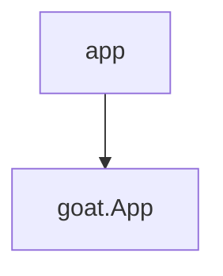

To add a function to the CLI app interface add a call to `goat.App`[<sup id="Z1039BV">↓</sup>](#f-Z1039BV) with with a `goat.Command`[<sup id="2lWAG5">↓</sup>](#f-2lWAG5) and your function ( `app`[<sup id="Z1GF2bO">↓</sup>](#f-Z1GF2bO)).  
Don't forget to call `Run()`[<sup id="2kl6B3">↓</sup>](#f-2kl6B3) `Run()`[<sup id="2kl6B3">↓</sup>](#f-2kl6B3)
<!-- NOTE-swimm-snippet: the lines below link your snippet to Swimm -->
### 📄 sample/main.go
```go
⬜ 54     	return errors.New(msg)
⬜ 55     }
⬜ 56     
🟩 57     func main() {
🟩 58     	goat.App("greeter",
🟩 59     		goat.Command(hello),
🟩 60     		goat.Command(greet),
🟩 61     		goat.Command(fail),
🟩 62     		goat.Command(app),
🟩 63     	).Run()
🟩 64     }
⬜ 65     
```

<br/>

# Example Function

<br/>

`Goat` has defaults for understanding your function's arguments. But you can add more options using `Flag`[<sup id="bgf28">↓</sup>](#f-bgf28). You can define the `Usage`[<sup id="Z28LpK0">↓</sup>](#f-Z28LpK0), `Name`[<sup id="Zm7vnb">↓</sup>](#f-Zm7vnb)and `Default`[<sup id="29qqV7">↓</sup>](#f-29qqV7) values.
<!-- NOTE-swimm-snippet: the lines below link your snippet to Swimm -->
### 📄 sample/main.go
```go
⬜ 8      
⬜ 9      //go:generate go run github.com/tmr232/goat/cmd/goater
⬜ 10     
🟩 11     func app(name string, goodbye bool, question *string, times int) error {
🟩 12     	goat.Self().
🟩 13     		Name("application").
🟩 14     		Usage("usage")
🟩 15     	goat.Flag(name).
🟩 16     		Usage("The name to greet")
🟩 17     	goat.Flag(goodbye).
🟩 18     		Name("bye").
🟩 19     		Usage("Enable to say Goodbye")
🟩 20     	goat.Flag(question).
🟩 21     		Usage("Instead of a greeting, ask a question.")
🟩 22     	goat.Flag(times).
🟩 23     		Usage("Number of repetitions").
🟩 24     		Default(1)
🟩 25     
🟩 26     	for i := 0; i < times; i++ {
🟩 27     		if question != nil {
🟩 28     			fmt.Printf("%s, %s?", *question, name)
🟩 29     		} else {
🟩 30     			if goodbye {
🟩 31     				fmt.Printf("Goodbye, %s.\n", name)
🟩 32     			} else {
🟩 33     				fmt.Printf("Hello, %s!\n", name)
🟩 34     			}
🟩 35     		}
🟩 36     	}
🟩 37     	return nil
🟩 38     }
⬜ 39     
⬜ 40     func hello() error {
⬜ 41     	goat.Self().
```

<br/>

<!--MERMAID {width:100}-->

<!--MCONTENT {content: graph TD  
A\[ `app`[<sup id="Z1GF2bO">↓</sup>](#f-Z1GF2bO)\] \-\-\> B\[ `goat.App`[<sup id="Z1039BV">↓</sup>](#f-Z1039BV)\]} --->

<br/>

<!-- THIS IS AN AUTOGENERATED SECTION. DO NOT EDIT THIS SECTION DIRECTLY -->
### Swimm Note

<span id="f-Z1GF2bO">app</span>[^](#Z1GF2bO) - "sample/main.go" L11
```go
func app(name string, goodbye bool, question *string, times int) error {
```

<span id="f-29qqV7">Default</span>[^](#29qqV7) - "sample/main.go" L24
```go
		Default(1)
```

<span id="f-bgf28">Flag</span>[^](#bgf28) - "goat.go" L146
```go
func Flag(any) FluentFlag {
```

<span id="f-Z1039BV">goat.App</span>[^](#Z1039BV) - "sample/main.go" L58
```go
	goat.App("greeter",
```

<span id="f-2lWAG5">goat.Command</span>[^](#2lWAG5) - "sample/main.go" L62
```go
		goat.Command(app),
```

<span id="f-Zm7vnb">Name</span>[^](#Zm7vnb) - "sample/main.go" L18
```go
		Name("bye").
```

<span id="f-2kl6B3">Run()</span>[^](#2kl6B3) - "sample/main.go" L63
```go
	).Run()
```

<span id="f-Z28LpK0">Usage</span>[^](#Z28LpK0) - "sample/main.go" L14
```go
		Usage("usage")
```

<br/>

This file was generated by Swimm. [Click here to view it in the app](https://app.swimm.io/repos/Z2l0aHViJTNBJTNBZ29hdCUzQSUzQXRtcjIzMg==/docs/2tsvu).